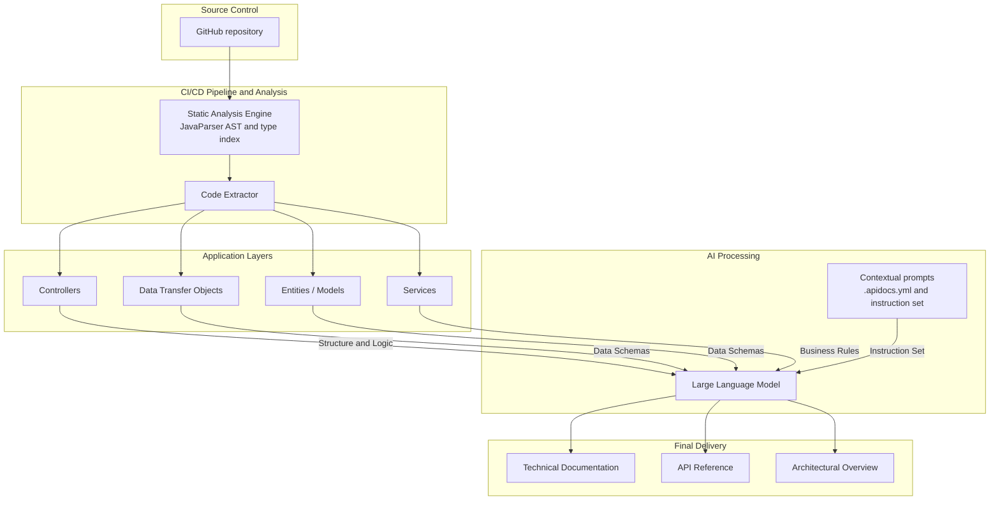

# API Docs Generator

Point it at a Spring Boot codebase and get a **Technical Documentation**, an **API Reference**, an **Architectural Overview** and an **OpenAPI 3.1** file.
Facts (paths, parameters, fields, validation rules, status codes, diagrams) are extracted from the source code; explanations (summaries, business rules, examples, architectural commentary) are written by an LLM of your choice.

## How it works



The analyzed code is only read, never compiled or executed, and symbolic links and NTFS junctions inside it are never followed. Tables, schemas, OpenAPI and diagrams come straight from the code, so the LLM cannot invent an endpoint or a field; it only writes the text around them, as JSON validated against a schema.

## Quick start

Requirements: Java 21 and Maven 3.9.

```bash
mvn -B verify
java -jar apidocs-cli/target/apidocs.jar generate examples/sample-api --output api-docs
```

Without a provider the tool runs in `dry-run` mode: every fact is generated, narrative sections show a placeholder and the prompts are saved in `api-docs/prompts/`. The prompts quote your source code, so that folder carries its own `.gitignore` and is never committed or published along with the documentation.

### Free LLM options

- **Gemini (free tier):** create a key in Google AI Studio, then
  ```bash
  export GEMINI_API_KEY=your-key
  java -jar apidocs-cli/target/apidocs.jar generate examples/sample-api --provider gemini
  ```
- **Ollama (local):** install Ollama, run `ollama pull qwen3:8b`, start it with `OLLAMA_CONTEXT_LENGTH=32768`, then use `--provider ollama`.

Paid providers work the same way: `--provider openai` (`OPENAI_API_KEY`) or `--provider anthropic` (`ANTHROPIC_API_KEY`).

## Providers

| Provider | Default model | Key variable | Notes |
|---|---|---|---|
| `dry-run` | — | — | No LLM; writes prompts for inspection |
| `gemini` | `gemini-3.8-flash` | `GEMINI_API_KEY` | OpenAI-compatible endpoint, limited to 10 requests/min |
| `ollama` | `qwen3:8b` | — | Local, `http://localhost:11434/v1/` |
| `openai` | `gpt-5-mini` | `OPENAI_API_KEY` | |
| `anthropic` | `claude-opus-5-5` | `ANTHROPIC_API_KEY` | Official Anthropic Java SDK |
| `custom` | `--model` | `--api-key-env` | Any OpenAI-compatible server via `--base-url` (Groq, OpenRouter, vLLM...) |

`custom` requires both `--model` and `--base-url`; its key is optional, so keyless local servers work without `--api-key-env`.

API keys are read only from environment variables, never from a file or a flag value. A key that contains control or non-ASCII characters (for example a trailing newline pasted from a file) is rejected with an error message that never shows the key. If the key itself is pasted where a variable name belongs (`--api-key-env` or `llm.apiKeyEnv`), that is, a value that is not a valid variable name or that looks like a key, the error says so without echoing it.

When an LLM call fails, the warning written to the output (`README.md`, `generation-report.json`) holds only a short summary such as `HTTP 429 from the LLM provider`, never the endpoint's host (a self-hosted one may be internal). The host and what the provider said, which can name your organization, project or account, are only logged to the console (`LLM call failed for <section>: <host>: ...`), with the API key, bearer tokens and other recognizable secrets masked as `***`.

Answers are cached per user in `~/.cache/apidocs/` (`%USERPROFILE%\.cache\apidocs` on Windows) unless `--cache-dir` points elsewhere; the default lies outside any analyzed project because cached answers quote its source code. Running again on unchanged code costs nothing and produces identical documents (only the timestamp in `generation-report.json` changes). Use `--no-cache` to bypass it.

## CLI

```text
apidocs generate <project-dir> [-o DIR] [--provider P] [--model M] [--base-url URL] [--api-key-env VAR]
                               [--language TAG] [--config FILE] [--cache-dir DIR] [--no-cache] [--strict] [-v]
apidocs analyze  <project-dir> [-o FILE] [--config FILE] [-v]
```

`generate` writes the documentation to `./api-docs` unless `-o` says otherwise. `--language` is a language tag such as `pt-BR` (default) or `en`. `-v` shows debug logs and stack traces. `analyze` runs only the static analysis, needs no LLM and prints the extracted model as JSON (to standard output, or to the file given with `-o`). On Windows prefer `analyze -o FILE`: the file is always UTF-8, while redirected standard output uses the console code page.

| Exit code | Meaning |
|---|---|
| 0 | Success (possibly with warnings) |
| 1 | Invalid arguments or configuration, missing or unusable API key, refused output folder, unexpected error |
| 2 | The project cannot be analyzed (missing folder, too many Java files, unparsable `pom.xml`, no `@RestController`) |
| 3 | The LLM failed and `--strict` was given (nothing is written) |
| 130 | Cancelled |

Precedence: command-line flags, then `APIDOCS_PROVIDER` / `APIDOCS_MODEL` / `APIDOCS_LANGUAGE`, then `.apidocs.yml`, then defaults.

## Project context (`.apidocs.yml`)

Place it at the root of the analyzed project (or point to another file with `--config`). API keys are refused here; they belong in environment variables.

```yaml
language: pt-BR
context:
  description: "B2C orders API"
  audience: "Front-end developers who consume the API"
  glossary:
    SKU: "Stock keeping unit"
  instructions: "Highlight stock and cancellation rules."
llm:
  provider: gemini
exclude:
  - "**/legacy/**"
```

The file lives inside the repository being analyzed, so it is treated as untrusted when it comes to credentials:

- Keys named like secrets (`apiKey`, `token`, `secret`, `password`...) are rejected at any nesting level, glossary terms included (a glossary entry called `token` needs another name).
- Values that look like secrets (`sk-...`, `AIza...`, `gsk_...`, `hf_...`, `xai-...`, `pplx-...`, `ghp_...`, `github_pat_...`, `AKIA...` or `xox?-...` tokens, or a `-----BEGIN ... PRIVATE KEY-----` block) are rejected wherever they appear, list items and glossary definitions included; the error names the path (say `context.instructions`) but never the value.
- Its `llm.provider` and `llm.model` can switch a run from the default `dry-run` to a paid provider, which then uses the key found in your environment. Check the file (or pass `--provider`) before running on a repository you do not trust.
- `llm.baseUrl` is honored only for the `custom` and `ollama` providers; `gemini`, `openai` and `anthropic` always use their official endpoint.
- `llm.apiKeyEnv` must be the provider's default variable or start with `APIDOCS_`; to read any other variable, use the `--api-key-env` flag.
- Its `llm.model`, `llm.baseUrl` and `llm.apiKeyEnv` are ignored when the file declares an `llm.provider` other than the one actually in use (for example, when you pass a different `--provider`), so a provider's settings never leak into another provider's run.

## Output

| File | Content |
|---|---|
| `README.md` | Index, numbers and warnings; names the provider and model that wrote the texts (never the LLM endpoint) |
| `technical-documentation.md` | Purpose, stack, domain concepts, business rules, error handling, glossary |
| `api-reference.md` | Every endpoint: parameters, bodies, responses, rules and examples |
| `architecture-overview.md` | Layer and ER diagrams (Mermaid), metrics, rule-based alerts with commentary |
| `openapi.yaml` | OpenAPI 3.1 |
| `model.json` | Raw model extracted from the code |
| `generation-report.json` | Provider, model, tokens, duration, warnings |
| `prompts/` | The prompts that would be sent to an LLM (`dry-run` only); they quote the source code, so the folder ignores itself in git (`prompts/.gitignore`) |

The output folder is written all at once and only replaces a previous apidocs output: a non-empty folder is overwritten only if it contains `generation-report.json` and nothing but files apidocs writes (OS metadata such as `.DS_Store` or `Thumbs.db` is tolerated). Any other folder is left untouched and the run fails with exit code 1 before the analysis and any LLM call; pick another `--output`.

Controllers that share a simple name (say `UserController` in both `v1` and `v2` packages) are documented under package-qualified names such as `com_example_v1_UserController`, so OpenAPI tags and operation ids stay unique; a warning lists each one. Two `@Service` classes with the same simple name also get a warning, because their calls and errors may be merged.

## Project layout

```text
apidocs-core   engine (no Spring): source, analysis, extraction, model, context, ai, generation, render, pipeline
apidocs-cli    picocli command line, packaged as apidocs.jar
examples/sample-api   Spring Boot orders API used for demos and tests
```

## Roadmap

1. Engine and CLI (this version)
2. Web platform: paste a GitHub repository URL or upload a `.zip`, follow the pipeline live and browse the result (Spring Boot + React)
3. GitHub integration: an Action that opens a pull request with updated docs, and a webhook endpoint
4. Public demo

## License

MIT
