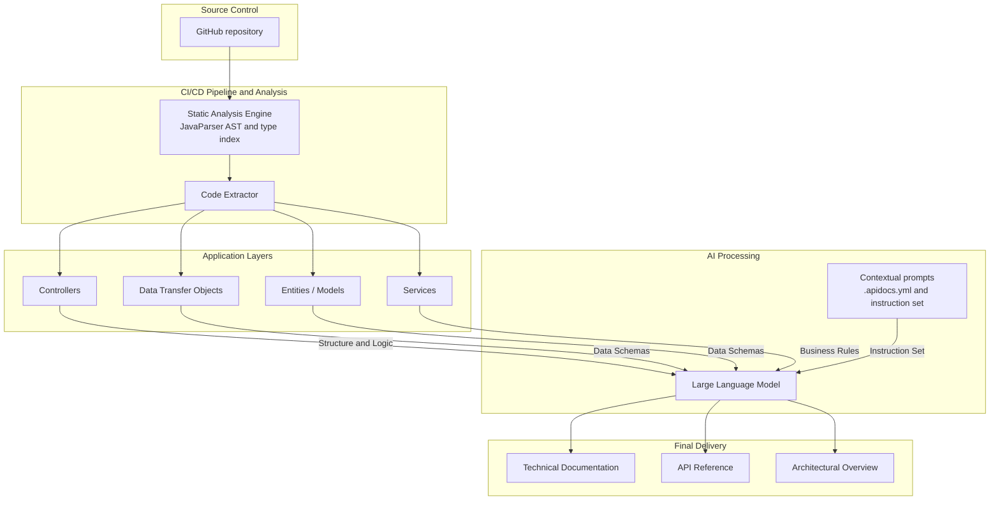

# API Docs Generator

[English](README.md) | **Português**

Aponte para um código Spring Boot e receba uma **Documentação Técnica**, uma **Referência da API**, uma **Visão Geral da Arquitetura** e um arquivo **OpenAPI 3.1**.
Os fatos (rotas, parâmetros, campos, regras de validação, códigos de status, diagramas) são extraídos do código-fonte; as explicações (resumos, regras de negócio, exemplos, comentários de arquitetura) são escritas por uma LLM à sua escolha.

## Como funciona



O código analisado é apenas lido, nunca compilado nem executado, e links simbólicos e junctions do NTFS dentro dele nunca são seguidos. Tabelas, esquemas, OpenAPI e diagramas vêm direto do código, então a LLM não consegue inventar um endpoint ou um campo; ela só escreve o texto em volta deles, em JSON validado contra um esquema.

## Início rápido

Requisitos: Java 21 e Maven 3.9.

```bash
mvn -B verify
java -jar apidocs-cli/target/apidocs.jar generate examples/sample-api --output api-docs
```

Sem um provedor, a ferramenta roda no modo `dry-run`: todos os fatos são gerados, as seções narrativas mostram um texto provisório e os prompts são salvos em `api-docs/prompts/`. Os prompts citam o seu código-fonte, por isso essa pasta tem o próprio `.gitignore` e nunca é commitada nem publicada junto com a documentação.

### Opções gratuitas de LLM

- **Gemini (camada gratuita):** crie uma chave no Google AI Studio e depois
  ```bash
  export GEMINI_API_KEY=sua-chave
  java -jar apidocs-cli/target/apidocs.jar generate examples/sample-api --provider gemini
  ```
- **Ollama (local):** instale o Ollama, rode `ollama pull qwen3:8b`, inicie-o com `OLLAMA_CONTEXT_LENGTH=32768` e use `--provider ollama`.

Os provedores pagos funcionam do mesmo jeito: `--provider openai` (`OPENAI_API_KEY`) ou `--provider anthropic` (`ANTHROPIC_API_KEY`).

## Provedores

| Provedor | Modelo padrão | Variável da chave | Observações |
|---|---|---|---|
| `dry-run` | — | — | Sem LLM; grava os prompts para inspeção |
| `gemini` | `gemini-3.8-flash` | `GEMINI_API_KEY` | Endpoint compatível com OpenAI, limitado a 10 requisições/min |
| `ollama` | `qwen3:8b` | — | Local, `http://localhost:11434/v1/` |
| `openai` | `gpt-5-mini` | `OPENAI_API_KEY` | |
| `anthropic` | `claude-opus-5-5` | `ANTHROPIC_API_KEY` | SDK Java oficial da Anthropic |
| `custom` | `--model` | `--api-key-env` | Qualquer servidor compatível com OpenAI via `--base-url` (Groq, OpenRouter, vLLM...) |

`custom` exige `--model` e `--base-url`; a chave é opcional, então servidores locais sem chave funcionam sem `--api-key-env`.

As chaves de API são lidas somente de variáveis de ambiente, nunca de um arquivo ou do valor de uma flag. Uma chave com caracteres de controle ou não ASCII (por exemplo, uma quebra de linha no final copiada de um arquivo) é recusada com uma mensagem de erro que nunca mostra a chave. Se a própria chave for colada onde deveria ir o nome de uma variável (`--api-key-env` ou `llm.apiKeyEnv`), ou seja, um valor que não é um nome de variável válido ou que parece uma chave, o erro avisa sem repeti-la.

Quando uma chamada à LLM falha, o aviso gravado na saída (`README.md`, `generation-report.json`) traz só um resumo curto como `HTTP 429 from the LLM provider`, nunca o host do endpoint (um servidor próprio pode ser interno). O host e a resposta do provedor, que pode citar a sua organização, projeto ou conta, aparecem apenas no console (`LLM call failed for <seção>: <host>: ...`), com a chave de API, tokens bearer e outros segredos reconhecíveis mascarados como `***`.

As respostas ficam em cache por usuário em `~/.cache/apidocs/` (`%USERPROFILE%\.cache\apidocs` no Windows), a menos que `--cache-dir` aponte para outro lugar; o padrão fica fora de qualquer projeto analisado porque as respostas em cache citam o código-fonte. Rodar de novo sobre o mesmo código não custa nada e produz documentos idênticos (só muda o horário em `generation-report.json`). Use `--no-cache` para ignorar o cache.

## Linha de comando

```text
apidocs generate <project-dir> [-o DIR] [--provider P] [--model M] [--base-url URL] [--api-key-env VAR]
                               [--language TAG] [--config FILE] [--cache-dir DIR] [--no-cache] [--strict] [-v]
apidocs analyze  <project-dir> [-o FILE] [--config FILE] [-v]
```

`generate` grava a documentação em `./api-docs`, a menos que `-o` indique outro lugar. `--language` é uma tag de idioma como `pt-BR` (padrão) ou `en`. `-v` mostra logs de depuração e stack traces. `analyze` roda só a análise estática, não precisa de LLM e imprime o modelo extraído em JSON (na saída padrão ou no arquivo indicado com `-o`). No Windows prefira `analyze -o ARQUIVO`: o arquivo é sempre UTF-8, enquanto a saída padrão redirecionada usa a página de código do console.

| Código de saída | Significado |
|---|---|
| 0 | Sucesso (possivelmente com avisos) |
| 1 | Argumentos ou configuração inválidos, chave de API ausente ou inutilizável, pasta de saída recusada, erro inesperado |
| 2 | O projeto não pode ser analisado (pasta inexistente, arquivos Java demais, `pom.xml` ilegível, nenhum `@RestController`) |
| 3 | A LLM falhou e `--strict` foi informado (nada é gravado) |
| 130 | Cancelado |

Precedência: flags da linha de comando, depois `APIDOCS_PROVIDER` / `APIDOCS_MODEL` / `APIDOCS_LANGUAGE`, depois `.apidocs.yml`, depois os padrões.

## Contexto do projeto (`.apidocs.yml`)

Coloque-o na raiz do projeto analisado (ou aponte para outro arquivo com `--config`). Chaves de API são recusadas aqui; o lugar delas é em variáveis de ambiente.

```yaml
language: pt-BR
context:
  description: "API de pedidos B2C"
  audience: "Desenvolvedores front-end que consomem a API"
  glossary:
    SKU: "Unidade de manutenção de estoque"
  instructions: "Destaque as regras de estoque e de cancelamento."
llm:
  provider: gemini
exclude:
  - "**/legacy/**"
```

O arquivo fica dentro do repositório analisado, então é tratado como não confiável no que diz respeito a credenciais:

- Chaves com nome de segredo (`apiKey`, `token`, `secret`, `password`...) são recusadas em qualquer nível, inclusive termos do glossário (um termo chamado `token` precisa de outro nome).
- Valores que parecem segredos (`sk-...`, `AIza...`, `gsk_...`, `hf_...`, `xai-...`, `pplx-...`, `ghp_...`, `github_pat_...`, `AKIA...` ou tokens `xox?-...`, ou um bloco `-----BEGIN ... PRIVATE KEY-----`) são recusados onde quer que apareçam, inclusive itens de lista e definições do glossário; o erro indica o caminho (por exemplo `context.instructions`), mas nunca o valor.
- `llm.provider` e `llm.model` podem trocar uma execução do `dry-run` padrão para um provedor pago, que então usa a chave encontrada no seu ambiente. Confira o arquivo (ou passe `--provider`) antes de rodar sobre um repositório em que você não confia.
- `llm.baseUrl` só é respeitado para os provedores `custom` e `ollama`; `gemini`, `openai` e `anthropic` sempre usam o endpoint oficial.
- `llm.apiKeyEnv` precisa ser a variável padrão do provedor ou começar com `APIDOCS_`; para ler qualquer outra variável, use a flag `--api-key-env`.
- `llm.model`, `llm.baseUrl` e `llm.apiKeyEnv` são ignorados quando o arquivo declara um `llm.provider` diferente do que está de fato em uso (por exemplo, quando você passa outro `--provider`), para que as configurações de um provedor nunca vazem para a execução de outro.

## Saída

| Arquivo | Conteúdo |
|---|---|
| `README.md` | Índice, números e avisos; indica o provedor e o modelo que escreveram os textos (nunca o endpoint da LLM) |
| `technical-documentation.md` | Propósito, stack, conceitos do domínio, regras de negócio, tratamento de erros, glossário |
| `api-reference.md` | Todos os endpoints: parâmetros, corpos, respostas, regras e exemplos |
| `architecture-overview.md` | Diagramas de camadas e ER (Mermaid), métricas, alertas baseados em regras com comentários |
| `openapi.yaml` | OpenAPI 3.1 |
| `model.json` | Modelo bruto extraído do código |
| `generation-report.json` | Provedor, modelo, tokens, duração, avisos |
| `prompts/` | Os prompts que seriam enviados a uma LLM (só no `dry-run`); eles citam o código-fonte, então a pasta se ignora no git (`prompts/.gitignore`) |

A pasta de saída é gravada de uma vez e só substitui uma saída anterior do apidocs: uma pasta não vazia só é sobrescrita se contiver `generation-report.json` e nada além de arquivos que o apidocs grava (metadados do sistema como `.DS_Store` ou `Thumbs.db` são tolerados). Qualquer outra pasta fica intacta e a execução falha com código 1 antes da análise e de qualquer chamada à LLM; escolha outro `--output`.

Controllers com o mesmo nome simples (por exemplo `UserController` nos pacotes `v1` e `v2`) são documentados com nomes qualificados pelo pacote, como `com_example_v1_UserController`, para que as tags e os operation ids do OpenAPI continuem únicos; um aviso lista cada um. Duas classes `@Service` com o mesmo nome simples também geram aviso, porque as chamadas e os erros delas podem se misturar.

## Estrutura do projeto

```text
apidocs-core   motor (sem Spring): source, analysis, extraction, model, context, ai, generation, render, pipeline
apidocs-cli    linha de comando com picocli, empacotada como apidocs.jar
examples/sample-api   API de pedidos em Spring Boot usada em demonstrações e testes
```

## Roadmap

1. Motor e CLI (esta versão)
2. Plataforma web: cole a URL de um repositório do GitHub ou envie um `.zip`, acompanhe o pipeline ao vivo e navegue pelo resultado (Spring Boot + React)
3. Integração com o GitHub: uma Action que abre um pull request com a documentação atualizada e um endpoint de webhook
4. Demonstração pública

## Licença

MIT
