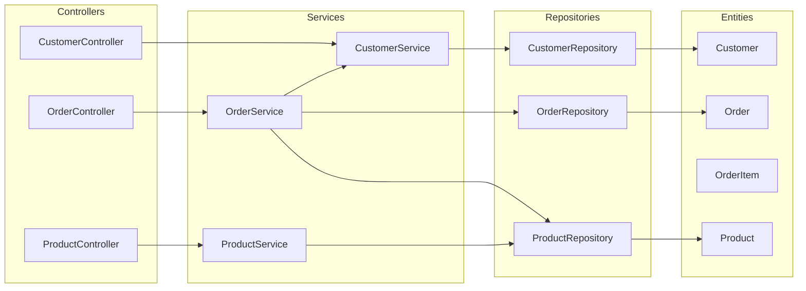
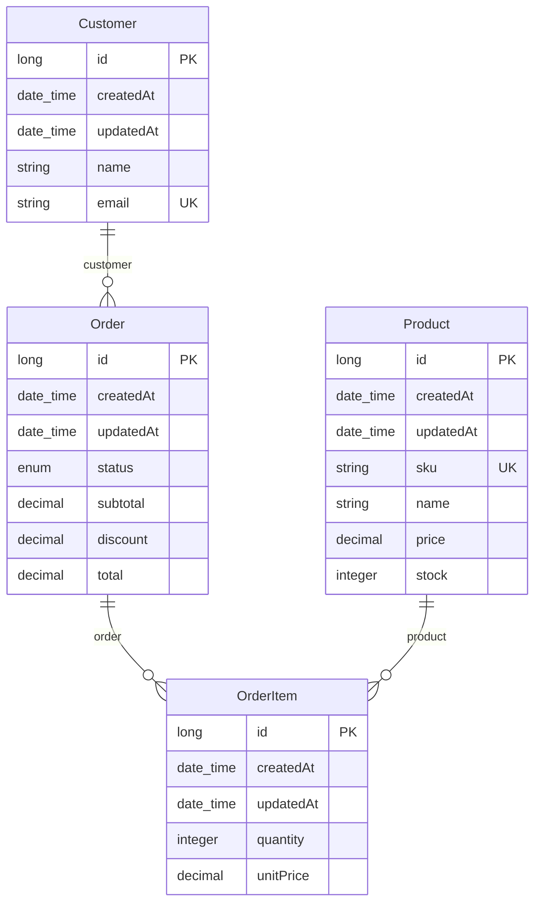

# Visão Arquitetural — Shop API

## Resumo

A aplicação segue uma arquitetura em camadas: controllers recebem as requisições HTTP e validam os DTOs, services concentram as regras de negócio e as transações, repositories do Spring Data acessam o banco e as entidades JPA representam o modelo persistido.

## Camadas

| Camada | Responsabilidade |
| --- | --- |
| Controllers | Expõem os endpoints REST, validam a entrada com Bean Validation e delegam aos services. |
| Services | Implementam as regras de estoque, desconto e ciclo de vida do pedido dentro de transações. |
| Repositories | Interfaces Spring Data JPA com consultas derivadas do nome do método. |
| Entities | Modelo persistido com JPA, com colunas de auditoria herdadas de BaseEntity. |
| DTOs | Records de entrada e saída que isolam o contrato da API do modelo persistido. |

## Modelo de dados

## Métricas

| Métrica | Valor |
| --- | --- |
| Controllers | 3 |
| Endpoints | 13 |
| Schemas (DTOs) | 14 |
| Entidades | 4 |
| Services | 3 |
| Repositories | 3 |
| Endpoints por controller (média) | 4,3 |
| Maior service (métodos públicos) | OrderService (7) |

## Padrões e convenções

- Arquitetura em camadas
- DTOs como records com métodos de fábrica from()
- Tratamento global de exceções com @RestControllerAdvice
- Paths centralizados em constantes na classe ApiPaths

## Alertas

| Código | Alvo | Detalhe |
| --- | --- | --- |
| `ENTITY_EXPOSED` | Customer | A entidade Customer é usada diretamente por GET /shop/api/customers/{id}. |

### Entidade exposta na API — Customer

O endpoint devolve a entidade JPA Customer diretamente, acoplando o contrato da API ao modelo do banco e arriscando expor campos internos.

**Recomendação:** Retornar CustomerResponse, como já faz o endpoint de cadastro.

## Recomendações

- Trocar o retorno de GET /shop/api/customers/{id} por CustomerResponse.
- Remover o endpoint obsoleto de pedidos por cliente depois de migrar os consumidores para a listagem paginada.
- Adicionar controle de concorrência na baixa de estoque para evitar vender acima do disponível.
